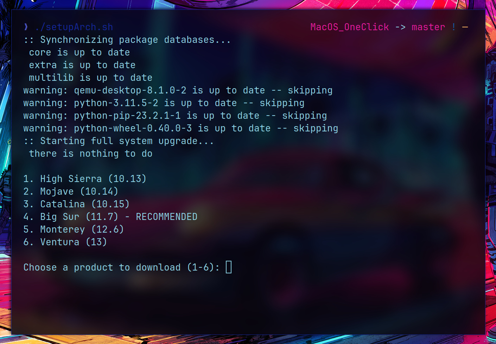
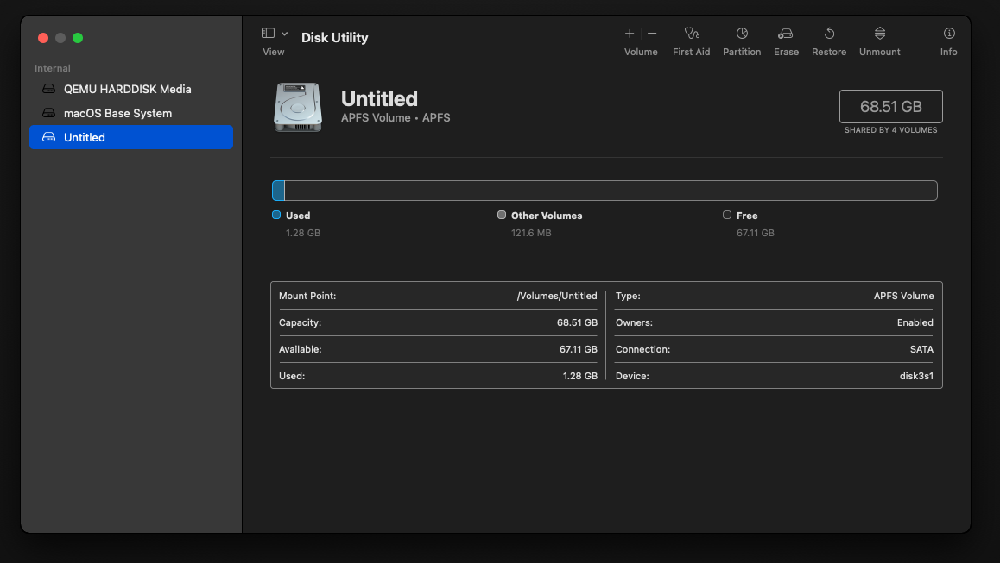

# MacOS_OneClick


### Direct Install Method

OneClick Method
```
    setup.sh is for Debian based Linux Repositories like Ubuntu
    setupArch.sh is for Arch based Linux Repositories like Manjaro.
    setupFedora.sh is for Fedora based Linux Repositories.
```

Run ```./setup.sh``` or the correct one depending on your Linux OS to make the VM. Once the VM boots up, just hit enter even if it's a black screen or a cut off image (do this every boot) Then format the biggest drive as macOS Extended Journaled (should be a little bigger than 64GB, then go to reinstall macOS and install it to the newly formatted drive.


Once it boots, you can install macOS. Remember to partition in Disk Utility first! (macOS extended journaled). Once macOS is succesfully installed, you can select the macOS partition with ctrl+enter to set it as the default boot and automatically boot up the VM without the macOS Installer attached. This will prevent OpenCore from default booting the installer.

### Migration

#### **Coming from OSX-KVM**

If you want to come from OSX-KVM, maybe for stability, it will be a little harder and take a little longer. First, place the BaseSystem file and the file that has macOS installed into the OneClick-macOS-Simple-KVM folder. Then, rename the file that has macOS installed (usually mac_hdd_ng.img) to macOS.img. Then run this command.
```bash
qemu-img convert -f qcow2 -O qcow2 macOS.img macOS.qcow2
```
Once that has completed, delete the macOS.img file. Then run ./basic.sh and enjoy.


### Optimizing

To make the VM run smoother and faster, look here: https://github.com/sickcodes/osx-optimizer

### FAQs
**Q: Does this work on any CPU?**

A: There is a minimum CPU requirement for macOS itself. Both Intel and AMD CPUs are supported, but the recommendations are Ivy Bridge (or later) Core and Xeon processors, or Ryzen and Threadripper processors.

**Q: How much disk space do I need?**

A: The jumpstart download is ~500MB compressed (2GB uncompressed), the installation files are uncompressed and measure 6.5GB. Bare minimum virtual disk size would be around 20GB, but you'll find it hard to get any apps installed (like Xcode, which is at least 8GB compressed).
